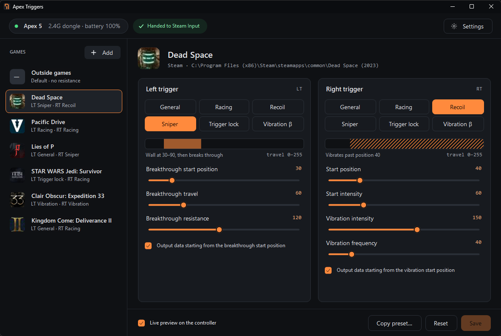
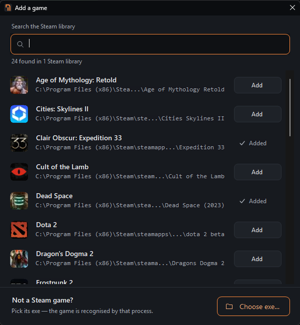
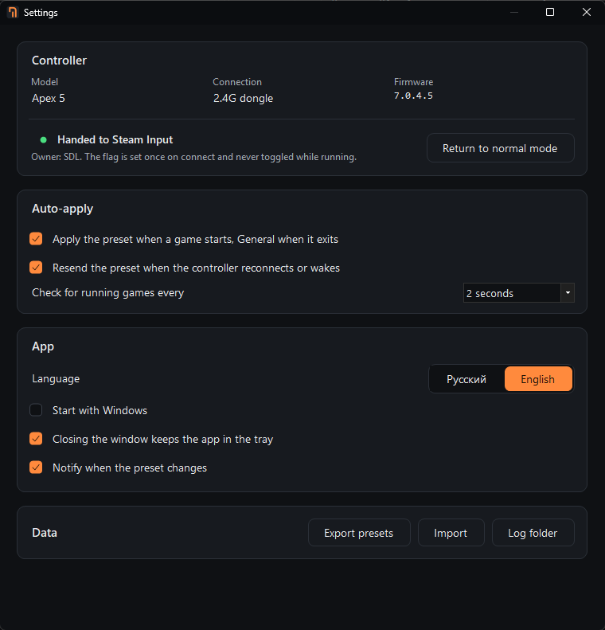
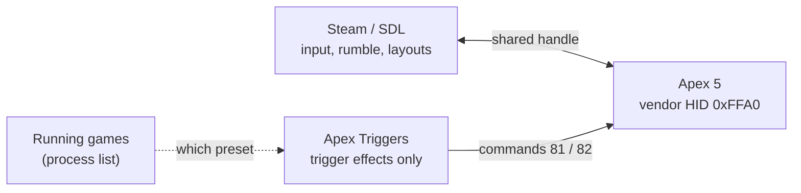

<div align="center">


# Apex Triggers

**Per-game adaptive trigger presets for the Flydigi Apex 5 — while Steam Input keeps the controller.**

<a href="https://github.com/STRENCH0/apex-triggers/releases/latest/download/ApexTriggers.exe">
  
</a>

[](https://github.com/STRENCH0/apex-triggers/releases/latest)
[](https://github.com/STRENCH0/apex-triggers/actions/workflows/ci.yml)
[](#requirements)
[](https://dotnet.microsoft.com/download/dotnet/10.0)
[](LICENSE)



</div>

---

## Why

The Apex 5 has motorised adaptive triggers, and Steam supports the pad natively — gyro, back paddles, extra
buttons — but only after you flip **"Allow third-party apps to take over mappings"** in Flydigi Space Station.
Once that switch is on, Space Station stops changing trigger settings. So every time you want a different
resistance you have to switch it off, adjust, and switch it on again. Doing that while Steam is running can give
the pad a **new identity in Steam**, and your Steam Input layouts for it go missing.

**Apex Triggers** removes the dance. It hands the pad to Steam Input once and then, **in parallel with Steam**,
sets the trigger effects itself over the pad's vendor HID interface. Steam keeps the controller, your layouts
stay put, and each game gets its own triggers automatically. Space Station isn't needed.

## Features

- 🎮 **Native Steam Input** — hands the pad to Steam on connect, so Steam sees an *Apex 5* with gyro and paddles.
  The flag is set once and never toggled while running, so Steam keeps one stable identity and your layouts.
- 🎯 **Presets per game** — mode and parameters for the left and right trigger separately, for every game.
- ⚡ **Auto-apply** — the preset goes on when the game starts and back to *General* when it exits;
  with several games running, the last one started wins.
- 🔁 **Survives reconnects** — after sleep, power-off or a dongle replug the current preset is sent again.
- 👀 **Live preview** — feel the change on the controller while you edit. Commands are sent only after the
  slider is released, so the trigger motors aren't hammered.
- 📚 **Steam library search** — add games from every Steam library folder, with icons from Steam's local cache;
  or pick any exe for games outside Steam.
- 🪶 **Lightweight** — a tray app that checks the process list every couple of seconds and holds no device
  handle while idle. No admin rights, no drivers, no network.
- 🌐 **English and Russian** interface.

## Screenshots

<table>
  <tr>
    <td width="44%"></td>
    <td width="56%"></td>
  </tr>
  <tr>
    <td align="center"><sub>Add games from the Steam library or by exe</sub></td>
    <td align="center"><sub>Controller status, auto-apply and app settings</sub></td>
  </tr>
</table>

## How it works



Steam and Apex Triggers open the same vendor collection of the pad independently, in shared mode. Steam does
input, rumble and your layouts; Apex Triggers only writes trigger effects (and, once, the handover flag). Effects
live in the pad's working memory and are re-sent whenever the pad reconnects — nothing is written to its flash.

## Trigger modes

The modes and parameter ranges match Space Station's trigger page.

| Mode | What it feels like | Parameters |
| --- | --- | --- |
| **General** | No added resistance | — |
| **Racing** | Constant resistance past a point, like a throttle | start position, strength |
| **Recoil** | The trigger vibrates on its own past a point — a machine gun | start position, start intensity, vibration intensity, frequency |
| **Sniper** | A wall of resistance that breaks through — a weapon's break point | start position, travel, resistance |
| **Trigger lock** | A hard stop; the axis goes digital (0 or 255) — a hair trigger | lock position |
| **Vibration** β | The game's own rumble routed into the trigger motors | intensity, threshold, travel range, frequency |

## Requirements

- Windows 10 (2004+) or Windows 11, x64 — nothing else to install: the .NET runtime is built into the exe
- Flydigi **Apex 5** with main firmware **7.0.3.1 or newer** — Steam's driver refuses older firmware.
  Check it in *Settings → Controller*; update it with Space Station if needed.
- Connected over the **2.4G dongle** or a **cable**. Bluetooth isn't supported: the protocol over Bluetooth hasn't
  been investigated.

## Getting started

1. **Quit Space Station** and stop its service — it can overwrite the handover flag and trigger effects.
   `Win+R` → `services.msc` → *Flydigi Space Station Service* → *Stop*, and set *Startup type* to *Manual*.
   You only need Space Station for firmware updates.
2. **Download** [`ApexTriggers.exe`](https://github.com/STRENCH0/apex-triggers/releases/latest/download/ApexTriggers.exe)
   from the latest release, put it in a folder where it will stay, and run it. No installer, no runtime, no admin
   rights. (Start with Windows remembers the exe's location — if you move the file later, turn the option on again.)

   <details>
   <summary>Or build from source</summary>

   ```powershell
   git clone https://github.com/STRENCH0/apex-triggers.git
   cd apex-triggers
   dotnet run --project src/ApexTriggers.App -c Release
   ```
   Requires the [.NET 10 SDK](https://dotnet.microsoft.com/download/dotnet/10.0).
   </details>
3. **Connect the pad.** Apex Triggers hands it to Steam Input; the top bar shows *Handed to Steam Input*.
4. **Add a game**, pick a mode for each trigger, tune the sliders with live preview on, and **Save**.
5. Launch the game — the preset goes on by itself. Close the window: the app keeps running in the tray.

> [!TIP]
> If Steam lists the pad twice right after the first handover (an *Apex 5* and an *XInput controller*), replug
> the dongle or power-cycle the pad once. With the flag already on, Steam registers only the native *Apex 5*
> from then on, under one stable identity.

## Safety

Apex Triggers talks to real hardware, so it is deliberately narrow:

- **Command whitelist in code.** Only device info (1), handover flag read/write (16, 17), grip rumble (18) and
  trigger effects (81, 82) can even be built. Flash writes, chip upgrade mode and factory reset are not
  representable.
- **Nothing is written to flash.** Effects live in the pad's working memory.
- **No game process access.** Running games are found by reading the process list with the same limited query
  right Task Manager uses — no memory reads, no injection, nothing for anti-cheat to object to.
- **Steam is never pushed out.** The device is opened in shared mode, and Steam's own acquire command is never sent.

## Files

| What | Where |
| --- | --- |
| Presets and settings | `%APPDATA%\ApexTriggers\config.json` — human-readable, copy it to move presets to another PC |
| Packet log | `%APPDATA%\ApexTriggers\logs\packets.log` (rotated) — attach it to bug reports |
| Autostart | `HKCU\Software\Microsoft\Windows\CurrentVersion\Run`, only when enabled in Settings |

## FAQ

<details>
<summary><b>My Steam Input layouts disappeared after the first handover.</b></summary>

Steam keys layouts to the controller's identity, and turning the handover on while Steam runs can mint a new one.
Apex Triggers sets the flag once and never toggles it, so after one reconnect the pad keeps a single identity.
Re-add the layout once if needed; it stays from then on.
</details>

<details>
<summary><b>The effect is gone after the pad slept.</b></summary>

The pad drops effects when it powers off. Apex Triggers notices the reconnect and sends the current preset again
within a couple of seconds — keep *Resend the preset when the controller reconnects* on.
</details>

<details>
<summary><b>Does it work without Steam?</b></summary>

Yes. Turn the handover off in *Settings → Return to normal mode*; trigger presets keep working with the pad in
ordinary XInput mode.
</details>

<details>
<summary><b>Other Flydigi controllers?</b></summary>

Only the Apex 5 is supported. Other models use different commands for their triggers.
</details>

## Acknowledgements

The protocol knowledge comes from [**OpenFlydigi**](https://github.com/mkaliaha/openflydigi) — an open
reimplementation of Flydigi's stack, with a detailed, hardware-verified
[protocol reference](https://github.com/mkaliaha/openflydigi/blob/main/PROTOCOL.md) — and from SDL's
[Flydigi driver](https://github.com/libsdl-org/SDL/blob/main/src/joystick/hidapi/SDL_hidapi_flydigi.c).

## Contributing

Bug reports, hardware test results and pull requests are welcome — see [CONTRIBUTING.md](CONTRIBUTING.md).

## License

[MIT](LICENSE) © 2026 STRENCH0

<sub>Apex Triggers is an independent project, not affiliated with or endorsed by Flydigi or Valve.
Flydigi and Apex are trademarks of their owner; Steam is a trademark of Valve Corporation.</sub>
